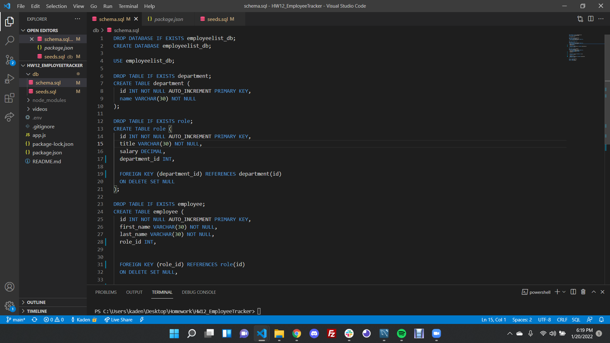
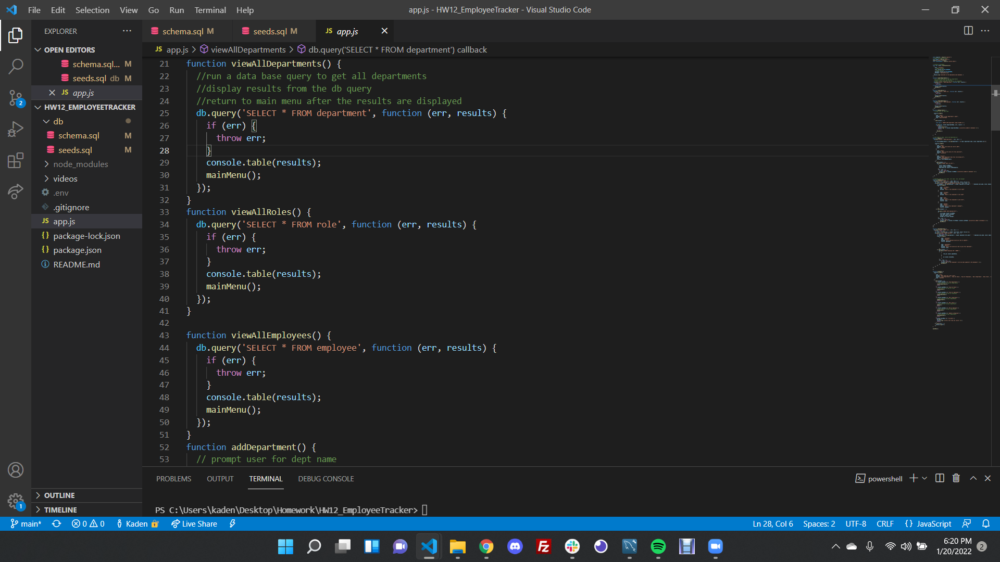
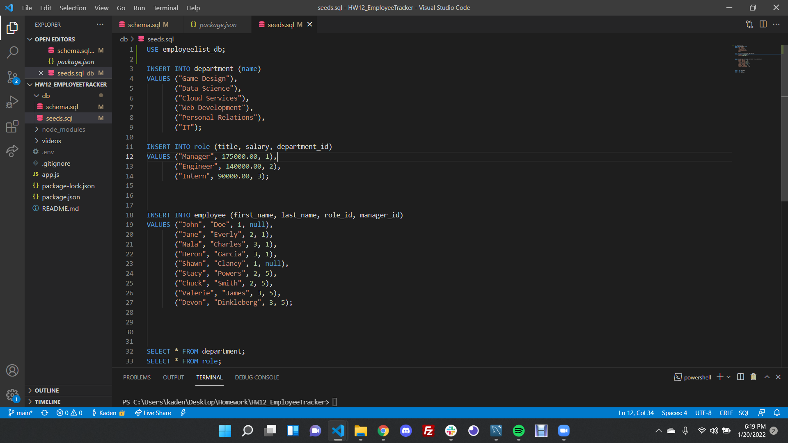

# HW12_EmployeeTracker
---
(https://opensource.org/licenses/MIT)
## INSTRUCTIONS
This project is designed to allow the user to view different departments, employees and job roles in a backend application. By booting up the application, you will be presented with an interface that allows you to update and add roles, departments and employees to an existing (or new) database. 

## Table of Contents
*[Installation:] (#installation)
*[Usage:] (#usage)
*[License:](license)
*[Contribution:] (#contributing)
*[Testing:] (#tests)
*[Questions?](#questions)

## Installation
To install this app so that it functions properly, clone my github repository, open the integrated terminal tied to the current project folder, then run 'npm install' in your terminal. This should download all necessary packages. Then in the db folder's intergrated terminal, sign in to your sql interface; source both the schema and seeds folder. Your database is now pre-populated.

## Usage
You can use this project to allow users to add new departments, roles, and employees to a database. These can be used to help sort and find employees based on department, role or manager names.

## Example
Here you can see some key elements within the code, that ensures that these objects are possible to create, that the path is being directed to the right location and how the these different data tables relate to one another:

 # License
            This project is license under the MIT license
            

## Contributing
Users can contribute to this project by playing with the code given and identifying more elaborate features that can be added to this program!

## Tests
This project can be tested by installing the necessary packages, seeding the database then running the program on your local environment to be tested via your intergrated terminal or tools alike such as gitbash or windows powershell.

You can find a walkthrough tutorial of me testing the application via the YouTube link: (https://youtu.be/-gpbwxzO6Mk)

<iframe width="560" height="315" src="https://www.youtube.com/embed/-gpbwxzO6Mk" title="YouTube video player" frameborder="0" allow="accelerometer; autoplay; clipboard-write; encrypted-media; gyroscope; picture-in-picture" allowfullscreen></iframe>

## Questions

    If you have any questions regarding the repository published, please feel free to reach out to me at kadenkelsey33@gmail.com,
    if you would like to look at the code that made this application, you can find this under my repos in GitHub. My GitHub
    username is K-Kelsey
    

